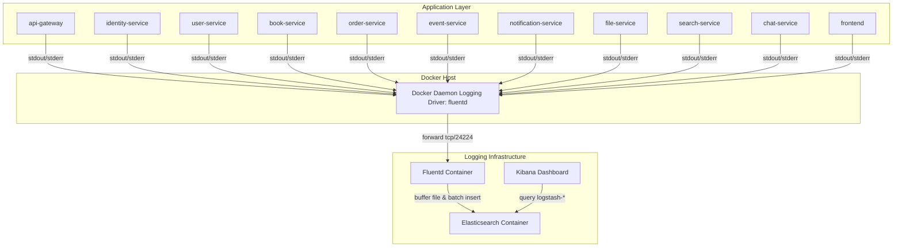

# HƯỚNG DẪN TRIỂN KHAI CENTRALIZED LOGGING (EFK STACK)

Tài liệu này hướng dẫn chi tiết cách vận hành và triển khai hệ thống quản lý Log tập trung (Centralized Logging) sử dụng bộ ba công cụ chuyên nghiệp **Elasticsearch - Fluentd - Kibana (EFK)** tích hợp trực tiếp vào hệ thống Microservices BookLand.

---

## 1. Tổng Quan Kiến Trúc Luồng Log

Trong hệ thống BookLand, logs được thu thập theo cơ chế **Non-intrusive** (Không can thiệp vào code ứng dụng). Các ứng dụng chỉ cần ghi log ra chuẩn đầu ra console (`stdout` / `stderr`). Docker Daemon và Fluentd sẽ lo phần còn lại:



### Cách thức hoạt động:
1. **Microservices** xuất logs ra console dưới dạng text/json chuẩn.
2. **Docker Daemon** bắt logs này thông qua **Fluentd Logging Driver** và gửi bất đồng bộ (`fluentd-async-connect: "true"`) tới cổng `24224` của container Fluentd để tránh làm nghẽn ứng dụng.
3. **Fluentd** tiếp nhận log, ghi tạm vào buffer file tại volume `/fluentd/log/` để chống mất mát log khi gặp sự cố, sau đó đẩy log theo lô (batch) sang **Elasticsearch** (port `9200`).
4. **Elasticsearch** phân tích cấu trúc, đánh chỉ mục (index) log theo dạng `bookland-YYYY.MM.DD`.
5. **Kibana** kết nối tới Elasticsearch, cho phép quản trị viên tìm kiếm, lọc và vẽ biểu đồ trực quan hóa dữ liệu logs qua cổng `5601`.

---

## 2. Chuẩn Bị Trước Khi Khởi Chạy

### Cấu hình phần cứng tối thiểu:
Elasticsearch và Kibana phiên bản 8.x yêu cầu cấu hình RAM tương đối để chạy ổn định:
- **RAM**: Tối thiểu 8GB trống (Khuyên dùng 16GB tổng dung lượng máy vật lý).
- **Docker Desktop**: Cấu hình phân bổ tối thiểu 4GB RAM cho WSL2/Docker VM để tránh Elasticsearch bị crash do lỗi **Out Of Memory (OOM)**.

---

## 3. Các Bước Triển Khai Chi Tiết

### Bước 1: Build các file JAR cho Backend
Mở Terminal tại thư mục gốc `P_BookLand_MS` và biên dịch mã nguồn của các microservices thành file `.jar`:
```bash
mvn clean package -DskipTests
```
*(Yêu cầu máy local có JDK 17 và Maven)*

### Bước 2: Khởi chạy toàn bộ hệ thống qua Docker Compose
Chạy lệnh khởi dựng toàn bộ tài nguyên bao gồm databases, microservices và cụm EFK:
```bash
docker compose up -d --build
```
> [!NOTE]
> - Hệ thống sẽ tự động build image Fluentd tùy chỉnh dựa trên `fluentd/Dockerfile`.
> - Nhờ cấu hình `fluentd-async-connect: "true"`, các container ứng dụng sẽ khởi động bình thường ngay cả khi Fluentd đang trong quá trình khởi tạo và cài đặt.

### Bước 3: Xác minh trạng thái hoạt động của cụm EFK
Kiểm tra xem các container của cụm EFK có đang chạy ổn định không:
```bash
docker compose ps
```
Đảm bảo 3 service sau đang ở trạng thái `Up` (Running):
- `bookland-elasticsearch` (Port: `9200`)
- `bookland-fluentd` (Port: `24224`)
- `bookland-kibana` (Port: `5601`)

Bạn cũng có thể xem log trực tiếp của Fluentd để kiểm tra kết nối với Elasticsearch:
```bash
docker compose logs -f fluentd
```
Nếu màn hình console hiển thị: `Connection opened to Elasticsearch cluster` nghĩa là Fluentd đã kết nối thành công tới Elasticsearch.

---

## 4. Thiết Lập Giao Diện Kibana Lần Đầu

Để bắt đầu truy vấn và theo dõi logs trên giao diện đồ họa Kibana, bạn cần tạo một **Data View** (trong các bản cũ gọi là *Index Pattern*). Thực hiện theo các bước sau:

1. **Truy cập Kibana**:
   - **Môi trường Local (Docker Compose)**: Mở trình duyệt web và truy cập địa chỉ [http://localhost:5601](http://localhost:5601).
   - **Môi trường Cloud / Kubernetes (Minikube)**: Do Kibana thường được chạy trong mạng nội bộ để bảo mật, bạn hãy dùng cơ chế `port-forward` từ máy cá nhân để kết nối trực tiếp vào Cluster Cloud bằng cách chạy lệnh sau trên Terminal máy local của bạn:
     ```bash
     kubectl port-forward svc/bookland-kibana 5601:5601 -n bookland
     ```
     Giữ nguyên Terminal này hoạt động, sau đó mở trình duyệt máy cá nhân và truy cập địa chỉ: [http://localhost:5601](http://localhost:5601).
2. **Đi tới phần Quản lý**: Ở menu bên trái (Sidebar), kéo xuống dưới cùng chọn **Management** -> **Stack Management**.
3. **Tạo Data View**:
   - Chọn mục **Data Views** (dưới phần *Kibana*).
   - Click nút **Create data view** ở góc phải trên cùng.
   - Nhập thông tin cấu hình:
     - **Name**: `bookland-*` (Ký tự đại diện `*` giúp Kibana quét mọi chỉ mục log tạo theo ngày).
     - **Timestamp field**: Chọn `@timestamp` (Trường thời gian do Fluentd tự động sinh ra khi bắt log).
   - Click **Save data view to Kibana**.
4. **Bắt đầu xem Logs**:
   - Nhấp vào biểu tượng menu chính ở góc trên bên trái -> chọn **Discover** (dưới nhóm *Analytics*).
   - Chọn Data View vừa tạo là `bookland-*`.
   - Bạn sẽ thấy toàn bộ logs từ các microservices hiển thị theo dạng dòng thời gian thực sinh động!

---

## 5. Hướng Dẫn Vận Hành & Lệnh Debug Hữu Ích

### Xem log của một Microservice cụ thể qua Fluentd
Do chúng ta đã chuyển đổi logging driver, lệnh `docker compose logs [service-name]` sẽ trống. Thay vào đó, bạn xem log tổng hợp qua Fluentd:
```bash
# Xem log thời gian thực của toàn bộ hệ thống
docker compose logs -f fluentd

# Xem log và filter theo tên service
docker compose logs -f fluentd | findstr "identity-service"  # Trên Windows cmd/powershell
# hoặc
docker compose logs -f fluentd | grep "identity-service"     # Trên Linux/macOS
```

### Kiểm tra các Index đang có trong Elasticsearch
Để kiểm tra xem Elasticsearch đã nhận được bao nhiêu index và dung lượng thế nào:
```bash
# Nếu chạy Local (Docker Compose):
curl -X GET "http://localhost:9200/_cat/indices?v&s=index"

# Nếu chạy trên Cloud / Kubernetes (Cần port-forward Elasticsearch trước trên máy local):
# kubectl port-forward svc/bookland-elasticsearch 9200:9200 -n bookland
# Sau đó chạy lệnh curl:
curl -X GET "http://localhost:9200/_cat/indices?v&s=index"
```
Bạn sẽ thấy các dòng dạng:
`green open bookland-2026.05.27 ...` tương ứng với ngày hiện tại.

### Khởi động lại riêng cụm EFK
Nếu bạn muốn tắt/bật lại chỉ riêng cụm ghi logs tập trung mà không ảnh hưởng tới DB hay các microservices đang chạy:
```bash
# Tắt cụm EFK
docker compose stop elasticsearch fluentd kibana

# Bật lại cụm EFK
docker compose start elasticsearch fluentd kibana
```

---

## 6. Xử Lý Các Sự Cố Thường Gặp (Troubleshooting)

### 1. Elasticsearch tự động thoát (Exited with code 137)
- **Nguyên nhân**: Lỗi Out of Memory (OOM) do máy chủ cạn RAM.
- **Khắc phục**: 
  - Tăng RAM cho Docker Desktop trong mục `Settings -> Resources -> Advanced` lên tối thiểu 4GB.
  - Tăng hoặc giới hạn tham số `-Xms512m -Xmx512m` trong biến `ES_JAVA_OPTS` của Elasticsearch (chúng tôi đã tối ưu ở mức 512MB để phù hợp máy cá nhân).

### 2. Không thấy logs hiển thị trên Kibana Discover
- **Nguyên nhân 1**: Chưa phát sinh request nào vào các microservices dẫn tới chưa có log được tạo ra.
  - *Khắc phục*: Truy cập Swagger UI hoặc Frontend, thực hiện đăng nhập hoặc lấy sách để tạo traffic và log mẫu.
- **Nguyên nhân 2**: Khoảng thời gian lọc trên góc phải Kibana (Time filter) đang chọn quá hẹp hoặc bị lệch múi giờ.
  - *Khắc phục*: Đổi khoảng thời gian lọc sang `Today`, `Last 1 hour`, hoặc `Last 24 hours`.

### 3. Sửa cấu hình Fluentd nhưng không có tác dụng
- **Nguyên nhân**: Docker Compose đang sử dụng bản build cũ trong cache.
- **Khắc phục**: Chạy lệnh build lại container Fluentd:
  ```bash
  docker compose up -d --build fluentd
  ```
