# Sơ đồ Sequence Diagram - Luồng Đặt hàng & Thanh toán (BookLand Microservice)

Tài liệu này mô tả chi tiết luồng hoạt động từ lúc **Khách hàng Checkout (Đặt hàng)** đến lúc **Thanh toán qua cổng VNPay**, cũng như cách **Admin/Shipper thay đổi trạng thái hóa đơn** và xử lý hoàn trả số lượng sách tồn kho (Stock) khi hủy đơn.

---

## 1. Sơ đồ Sequence Diagram (Mermaid)

```mermaid
sequenceDiagram
    autonumber
    actor User as Khách hàng / Client (FE)
    actor Admin as Admin / Staff / Shipper
    participant GW as API Gateway (:8080)
    participant AuthSvc as Identity Service (:8081)
    participant OrderSvc as Order Service (:8084)
    participant BookSvc as Book Service (:8083)
    participant EventSvc as Event Service (:8085)
    participant UserSvc as User Service (:8082)
    participant VNPay as VNPay Gateway
    participant Kafka as Kafka Broker
    participant NotifSvc as Notification Service (:8086)
    
    %% SECTION 1: CHECKOUT FLOW
    Note over User, OrderSvc: PHẦN 1: LUỒNG ĐẶT HÀNG (CHECKOUT FLOW)
    User->>GW: POST /api/bills (CreateBillRequest)<br/>Headers: Authorization: Bearer <JWT>
    activate GW
    GW->>AuthSvc: POST /auth/introspect {token}
    activate AuthSvc
    AuthSvc-->>GW: Trả về {valid: true, userId, roles, email}
    deactivate AuthSvc
    
    Note over GW: Thêm thông tin vào request header:<br/>X-User-Id, X-User-Roles, X-User-Email
    GW->>OrderSvc: Forward POST /api/bills<br/>Headers: X-User-Id, X-User-Email
    activate OrderSvc
    
    Note over OrderSvc: 1. Validate PaymentMethod & ShippingMethod trong DB
    
    loop Duyệt qua từng sách trong request
        OrderSvc->>BookSvc: GET /api/books/{id} (Lấy thông tin giá & tồn kho)
        activate BookSvc
        BookSvc-->>OrderSvc: Trả về BookResponse (stock, finalPrice)
        deactivate BookSvc
        alt Tồn kho < Số lượng đặt
            OrderSvc-->>GW: Ném ngoại lệ BOOK_OUT_OF_STOCK (400)
            GW-->>User: Trả về lỗi 400 Bad Request
        end
    end
    
    OrderSvc->>EventSvc: GET /api/internal/events/highest-priority (Lấy sự kiện khuyến mãi lớn nhất)
    activate EventSvc
    EventSvc-->>OrderSvc: Trả về EventResponse (rules, targets, actions)
    deactivate EventSvc
    
    Note over OrderSvc: 2. Kiểm tra điều kiện áp dụng (EventRule) & tính số tiền giảm giá
    
    OrderSvc->>UserSvc: GET /api/users/profile/{userId}
    activate UserSvc
    UserSvc-->>OrderSvc: Trả về UserProfileResponse (username, address)
    deactivate UserSvc
    
    Note over OrderSvc: 3. Tính toán tổng chi phí (totalCost)<br/>4. Lưu hóa đơn vào DB (status: PENDING)
    
    loop Trừ số lượng tồn kho của từng sách (Deduct Stock)
        OrderSvc->>BookSvc: PUT /api/internal/books/{id}/stock (Cập nhật stock)
        activate BookSvc
        BookSvc-->>OrderSvc: Xác nhận cập nhật thành công (atomic update)
        deactivate BookSvc
    end
    
    Note over OrderSvc: 5. Xóa các mục trong giỏ hàng (Cart) của User
    
    OrderSvc->>Kafka: Publish "order.created" Event<br/>(NotificationEvent chứa data email)
    activate Kafka
    Kafka-->>OrderSvc: Acknowledge
    deactivate Kafka
    
    OrderSvc-->>GW: Trả về BillDTO (status: PENDING)
    deactivate OrderSvc
    GW-->>User: Trả về BillDTO (status: PENDING)
    deactivate GW
    
    %% Async Notification for Order Placed
    activate NotifSvc
    Kafka--)NotifSvc: Consume event "order.created"
    Note over NotifSvc: 1. Lưu thông báo vào MongoDB (status: Chưa đọc)<br/>2. Gửi email xác nhận đặt hàng qua SMTP
    NotifSvc-->>User: Đẩy WebSocket Push & gửi Email
    deactivate NotifSvc

    %% SECTION 2: PAYMENT FLOW (VNPAY)
    Note over User, VNPay: PHẦN 2: LUỒNG THANH TOÁN ONLINE (VNPAY FLOW)
    alt Phương thức thanh toán là VNPay
        User->>GW: POST /api/online-payment/create-payment?billId={billId}
        activate GW
        Note over GW: Đường dẫn /api/online-payment/** bỏ qua kiểm tra JWT
        GW->>OrderSvc: Forward POST /api/online-payment/create-payment?billId={billId}
        activate OrderSvc
        
        Note over OrderSvc: 1. Tạo PaymentTransaction (status: PENDING)<br/>2. Sinh mã giao dịch duy nhất vnp_TxnRef<br/>3. Ký hash tham số (HMAC-SHA512) với SecretKey
        
        OrderSvc-->>GW: Trả về PaymentResponse (status: OKE, url: vnp_PayUrl)
        deactivate OrderSvc
        GW-->>User: Trả về PaymentResponse (vnp_PayUrl)
        deactivate GW
        
        User->>VNPay: Redirect trình duyệt đến vnp_PayUrl
        activate VNPay
        Note over User, VNPay: Người dùng nhập thông tin thẻ & OTP xác thực
        VNPay-->>User: Redirect về ReturnUrl trên FE (payment_infor)
        deactivate VNPay
        
        User->>GW: GET /api/online-payment/payment_infor?vnp_ResponseCode=00&vnp_TxnRef=...
        activate GW
        GW->>OrderSvc: Forward GET /api/online-payment/payment_infor
        activate OrderSvc
        
        Note over OrderSvc: 1. Kiểm tra chữ ký bảo mật (SecureHash)<br/>2. Tìm PaymentTransaction dựa trên vnp_TxnRef
        
        alt vnp_ResponseCode == "00" (Thành công)
            Note over OrderSvc: 3. Cập nhật Transaction status = SUCCESS<br/>4. Cập nhật Bill status = APPROVED (paymentStatus: SUCCESS)
            OrderSvc->>Kafka: Publish "order.status.updated" Event (APPROVED)
            activate Kafka
            Kafka-->>OrderSvc: Acknowledge
            deactivate Kafka
            OrderSvc-->>GW: Trả về PaymentTransactionDTO (status: OK)
            GW-->>User: Hiển thị giao diện thanh toán thành công
        else vnp_ResponseCode != "00" (Thất bại)
            Note over OrderSvc: 3. Cập nhật Transaction status = FAILED
            OrderSvc-->>GW: Trả về PaymentTransactionDTO (status: NO)
            deactivate OrderSvc
            GW-->>User: Hiển thị giao diện thanh toán thất bại
            deactivate GW
        end
        
        %% Async Notification for Payment Status
        activate NotifSvc
        Kafka--)NotifSvc: Consume event "order.status.updated" (APPROVED)
        Note over NotifSvc: 1. Lưu thông báo vào MongoDB (APPROVED)<br/>2. Gửi email xác nhận thanh toán thành công
        NotifSvc-->>User: Đẩy WebSocket Push & gửi Email
        deactivate NotifSvc
    end

    %% SECTION 3: ADMIN STATE TRANSITIONS
    Note over Admin, OrderSvc: PHẦN 3: ADMIN & SHIPPER CẬP NHẬT TRẠNG THÁI (STATE TRANSITIONS)
    
    %% Transition: APPROVED -> SHIPPING (Shipped/Prepared by Admin)
    Note over Admin, OrderSvc: Luồng 3.1: Admin duyệt và gửi hàng (APPROVED -> SHIPPING)
    Admin->>GW: PATCH /api/bills/{id}/status {status: SHIPPING}<br/>Headers: Authorization (Admin JWT)
    activate GW
    GW->>AuthSvc: Introspect Token (Kiểm tra quyền ADMIN/STAFF)
    AuthSvc-->>GW: Trả về active user (Role: ADMIN)
    GW->>OrderSvc: Forward PATCH /api/bills/{id}/status {status: SHIPPING}
    activate OrderSvc
    Note over OrderSvc: 1. Validate trạng thái hợp lệ: APPROVED -> SHIPPING<br/>2. Cập nhật Bill status = SHIPPING
    OrderSvc->>Kafka: Publish "order.status.updated" (SHIPPING)
    activate Kafka
    Kafka-->>OrderSvc: Acknowledge
    deactivate Kafka
    OrderSvc-->>GW: Trả về BillDTO (SHIPPING)
    deactivate OrderSvc
    GW-->>Admin: Response 200 OK
    deactivate GW
    
    activate NotifSvc
    Kafka--)NotifSvc: Consume event "order.status.updated" (SHIPPING)
    NotifSvc-->>User: Push WebSocket "Đơn hàng của bạn đang được giao"
    deactivate NotifSvc

    %% Transition: SHIPPING -> SHIPPED (Shipper confirms delivered)
    Note over Admin, OrderSvc: Luồng 3.2: Shipper xác nhận đã giao (SHIPPING -> SHIPPED)
    Admin->>GW: PATCH /api/bills/{id}/confirm-delivered<br/>Headers: X-User-Roles: ROLE_SHIPPER
    activate GW
    GW->>OrderSvc: Forward PATCH /api/bills/{id}/confirm-delivered
    activate OrderSvc
    Note over OrderSvc: 1. Kiểm tra trạng thái hiện tại phải là SHIPPING<br/>2. Cập nhật Bill status = SHIPPED
    OrderSvc->>Kafka: Publish "order.status.updated" (SHIPPED)
    activate Kafka
    Kafka-->>OrderSvc: Acknowledge
    deactivate Kafka
    OrderSvc-->>GW: Trả về BillDTO (SHIPPED)
    deactivate OrderSvc
    GW-->>Admin: Response 200 OK
    deactivate GW
    
    activate NotifSvc
    Kafka--)NotifSvc: Consume event "order.status.updated" (SHIPPED)
    NotifSvc-->>User: Push WebSocket "Giao hàng thành công, chờ xác nhận hoàn tất"
    deactivate NotifSvc

    %% Transition: SHIPPED -> COMPLETED (Admin completes order)
    Note over Admin, OrderSvc: Luồng 3.3: Admin hoàn thành đơn hàng (SHIPPED -> COMPLETED)
    Admin->>GW: PATCH /api/bills/{id}/status {status: COMPLETED}
    activate GW
    GW->>OrderSvc: Forward PATCH /api/bills/{id}/status {status: COMPLETED}
    activate OrderSvc
    Note over OrderSvc: 1. Validate trạng thái hợp lệ: SHIPPED -> COMPLETED<br/>2. Cập nhật Bill status = COMPLETED
    OrderSvc->>Kafka: Publish "order.status.updated" (COMPLETED)
    activate Kafka
    Kafka-->>OrderSvc: Acknowledge
    deactivate Kafka
    OrderSvc-->>GW: Trả về BillDTO (COMPLETED)
    deactivate OrderSvc
    GW-->>Admin: Response 200 OK
    deactivate GW
    
    activate NotifSvc
    Kafka--)NotifSvc: Consume event "order.status.updated" (COMPLETED)
    NotifSvc-->>User: Push WebSocket & gửi Email "Đơn hàng hoàn tất"
    deactivate NotifSvc

    %% Transition: ANY -> CANCELED (Admin or User cancels order)
    Note over Admin, OrderSvc: Luồng 3.4: Hủy đơn hàng và hoàn lại tồn kho (PENDING/APPROVED/SHIPPING -> CANCELED)
    Admin->>GW: PATCH /api/bills/{id}/status {status: CANCELED}
    activate GW
    GW->>OrderSvc: Forward PATCH /api/bills/{id}/status {status: CANCELED}
    activate OrderSvc
    Note over OrderSvc: 1. Validate trạng thái hiện tại có thể chuyển sang CANCELED
    
    loop Hoàn trả stock cho từng sách trong đơn
        OrderSvc->>BookSvc: GET /api/books/{id} (Lấy tồn kho hiện tại)
        activate BookSvc
        BookSvc-->>OrderSvc: Trả về BookResponse (stock hiện tại)
        deactivate BookSvc
        OrderSvc->>BookSvc: PUT /api/internal/books/{id}/stock (Cập nhật stock mới = hiện tại + số lượng trong đơn)
        activate BookSvc
        BookSvc-->>OrderSvc: Xác nhận hoàn trả stock thành công
        deactivate BookSvc
    end
    
    Note over OrderSvc: 2. Nếu đơn hàng đã thanh toán (APPROVED - VNPay),<br/>gửi request refund tới cổng VNPay (tùy chọn mở rộng)<br/>3. Cập nhật Bill status = CANCELED
    
    OrderSvc->>Kafka: Publish "order.status.updated" (CANCELED)
    activate Kafka
    Kafka-->>OrderSvc: Acknowledge
    deactivate Kafka
    OrderSvc-->>GW: Trả về BillDTO (CANCELED)
    deactivate OrderSvc
    GW-->>Admin: Response 200 OK
    deactivate GW
    
    activate NotifSvc
    Kafka--)NotifSvc: Consume event "order.status.updated" (CANCELED)
    NotifSvc-->>User: Push WebSocket & gửi Email thông báo đơn hàng đã bị hủy
    deactivate NotifSvc
```

---

## 2. Giải thích chi tiết các pha xử lý

### Pha 1: Khách hàng Checkout (Đặt hàng)
1. **User (Client)** gửi request `POST /api/bills` chứa các thông tin như địa chỉ giao hàng (`shippingAddressId`), phương thức vận chuyển (`shippingMethodId`), phương thức thanh toán (`paymentMethodId`), mã giảm giá (`eventCode`), và danh sách các quyển sách cần mua cùng số lượng tương ứng.
2. **API Gateway** chặn request và thực hiện xác thực token JWT thông qua **Identity Service** (`POST /auth/introspect`). Sau khi xác thực thành công, Gateway chèn thêm thông tin người dùng (`X-User-Id`, `X-User-Email`) vào request header và forward tới **Order Service**.
3. **Order Service** kiểm tra số lượng tồn kho từng sản phẩm bằng cách gọi REST API nội bộ của **Book Service** (`GET /api/books/{id}`). Nếu có bất kỳ quyển sách nào không đủ tồn kho, hệ thống ném ra ngoại lệ `BOOK_OUT_OF_STOCK` và trả về mã lỗi `400 Bad Request`.
4. Gọi **Event Service** để lấy thông tin khuyến mãi hiện tại. Nếu đơn hàng thỏa mãn các điều kiện quy định (`MIN_ORDER_VALUE`, `MIN_QUANTITY`, v.v.), hệ thống tự động giảm giá sản phẩm.
5. Gọi **User Service** để lấy thông tin chi tiết địa chỉ giao hàng của người dùng.
6. Tính toán giá tiền và lưu thông tin hóa đơn (`Bill`) vào cơ sở dữ liệu (`order_db`) với trạng thái ban đầu là `PENDING`. Lưu cả thông tin chi tiết các sản phẩm được mua tại thời điểm đó vào bảng `bill_books` (Snapshot giá và thông tin sách).
7. Tiến hành trừ số lượng tồn kho của sách bằng cách gọi API nội bộ tới **Book Service** (`PUT /api/internal/books/{id}/stock`). Xóa giỏ hàng hiện tại của khách hàng.
8. Gửi message sự kiện đặt hàng thành công (`order.created`) lên **Kafka Broker**.
9. Trả kết quả `BillDTO` về cho phía Client. Phía **Notification Service** tiêu thụ (consume) message từ Kafka để gửi Email xác nhận đơn hàng đồng thời gửi WebSocket push (In-app Notification) đến thiết bị khách hàng.

### Pha 2: Thanh toán Online bằng VNPay
1. Nếu phương thức thanh toán là `VNPAY`, sau khi tạo đơn hàng thành công, Client sẽ gửi request tiếp theo là `POST /api/online-payment/create-payment?billId={billId}` lên API Gateway.
2. API Gateway bỏ qua bước xác thực JWT đối với endpoint `/api/online-payment/**` theo cấu hình để tránh xung đột với callback của VNPay, sau đó chuyển request tới **Order Service**.
3. **Order Service** tìm thông tin hóa đơn, tạo một bản ghi giao dịch `PaymentTransaction` mới có trạng thái `PENDING` và sinh mã tham chiếu duy nhất `vnp_TxnRef`. Hệ thống chuẩn bị các tham số cần thiết, sắp xếp theo thứ tự alphabet, thực hiện hash chữ ký số (HMAC-SHA512) bằng khóa bí mật (`SecretKey`) và ghép thành URL thanh toán hoàn chỉnh.
4. Trả về URL thanh toán VNPay cho Client. Trình duyệt của Khách hàng tự động chuyển hướng (Redirect) tới cổng thanh toán VNPay.
5. Khách hàng thực hiện các bước xác thực thanh toán trên VNPay. Sau khi hoàn tất, VNPay thực hiện Redirect trình duyệt khách hàng quay trở lại ReturnUrl của hệ thống (`GET /api/online-payment/payment_infor` trên Gateway).
6. **Order Service** nhận request callback:
   - Thực hiện tính toán chữ ký số từ các tham số nhận được và so sánh với chữ ký `vnp_SecureHash` gửi kèm từ VNPay để chống giả mạo request.
   - Tìm bản ghi giao dịch bằng `vnp_TxnRef`.
   - Nếu `vnp_ResponseCode == "00"` (Thành công): Cập nhật trạng thái `PaymentTransaction` thành `SUCCESS`, đồng thời chuyển trạng thái đơn hàng `Bill` sang `APPROVED` (Đã duyệt / Đã thanh toán) và cập nhật `paymentStatus = "SUCCESS"`. Publish sự kiện `order.status.updated` lên Kafka để Notification Service gửi email/WebSocket push thông báo thanh toán thành công.
   - Nếu thanh toán thất bại (`vnp_ResponseCode != "00"`): Cập nhật trạng thái giao dịch thành `FAILED`, đơn hàng vẫn ở trạng thái `PENDING` để người dùng có thể thử lại hoặc hủy đơn sau đó.

### Pha 3: Admin & Shipper Cập nhật trạng thái (State Machine Transitions)
Trạng thái của hóa đơn (`BillStatus`) được quản lý chặt chẽ theo sơ đồ máy trạng thái (State Machine):
`PENDING` $\rightarrow$ `APPROVED` $\rightarrow$ `SHIPPING` $\rightarrow$ `SHIPPED` $\rightarrow$ `COMPLETED` (Hoặc có thể chuyển sang `CANCELED` ở bất kỳ bước nào trước khi hoàn tất giao hàng).

1. **Duyệt chuẩn bị hàng (APPROVED $\rightarrow$ SHIPPING)**:
   - Admin/Staff chuẩn bị xong gói hàng và gọi `PATCH /api/bills/{id}/status` với body chứa `{ "status": "SHIPPING" }`.
   - API Gateway xác minh quyền Admin, chuyển request xuống **Order Service**.
   - **Order Service** thực hiện kiểm tra xem đơn hàng có thuộc trạng thái `APPROVED` trước đó hay không. Nếu hợp lệ, cập nhật trạng thái hóa đơn thành `SHIPPING` và publish sự kiện cập nhật trạng thái lên Kafka.
   - **Notification Service** tiêu thụ sự kiện và thông báo tới khách hàng đơn hàng đang trên đường vận chuyển.

2. **Shipper giao hàng thành công (SHIPPING $\rightarrow$ SHIPPED)**:
   - Khi Shipper giao hàng thành công cho khách hàng, Shipper gọi API `PATCH /api/bills/{id}/confirm-delivered` (Yêu cầu role `ROLE_SHIPPER`).
   - **Order Service** kiểm tra quyền và xác nhận trạng thái hiện tại là `SHIPPING`. Tiến hành chuyển trạng thái hóa đơn thành `SHIPPED`.
   - Gửi thông báo WebSocket tới khách hàng để báo đơn hàng đã được giao thành công và chờ xác nhận hoàn tất.

3. **Hoàn tất đơn hàng (SHIPPED $\rightarrow$ COMPLETED)**:
   - Sau khi khách hàng kiểm tra hàng và xác nhận hài lòng hoặc sau một khoảng thời gian tự động, Admin gọi `PATCH /api/bills/{id}/status` với trạng thái `COMPLETED`.
   - Hệ thống chuyển trạng thái đơn hàng thành `COMPLETED` (Trạng thái cuối cùng - Terminal State). Gửi email/WebSocket thông báo hoàn tất đơn hàng.

4. **Hủy đơn hàng và hoàn trả tồn kho (PENDING/APPROVED/SHIPPING $\rightarrow$ CANCELED)**:
   - Nếu Khách hàng hoặc Admin yêu cầu hủy đơn hàng, hệ thống gọi API `PATCH /api/bills/{id}/status` với trạng thái `CANCELED`.
   - **Order Service** kiểm tra điều kiện hủy (không thể hủy đơn hàng đã ở trạng thái `SHIPPED` hoặc `COMPLETED`).
   - Xử lý hoàn trả số lượng sách tồn kho: Hệ thống duyệt qua danh sách các sản phẩm trong hóa đơn (`bill_books`), gọi API nội bộ tới **Book Service** (`PUT /api/internal/books/{id}/stock`) để cộng lại số lượng sách tương ứng vào kho.
   - Nếu đơn hàng đã được thanh toán online trước đó qua VNPay, hệ thống có thể kích hoạt tiến trình hoàn tiền (Refund API) tới VNPay.
   - Cập nhật trạng thái hóa đơn thành `CANCELED`. Publish sự kiện cập nhật trạng thái lên Kafka để gửi email/WebSocket push báo hủy đơn thành công.
